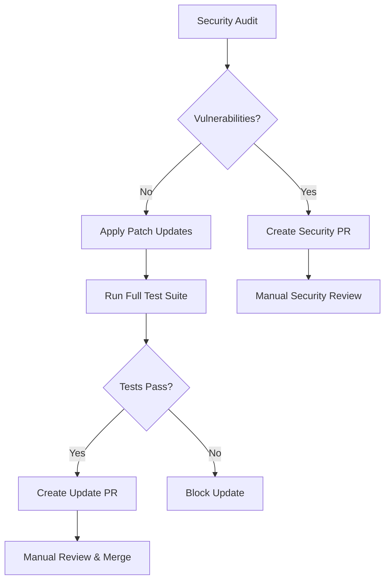

# TuneTussle Package Management System

**Complete Developer Guide for Automated Dependency Management**

## 🎯 Overview

TuneTussle implements a **production-ready, automated package management system** that keeps dependencies current while preventing breaking changes. This system has been fully implemented and tested.

## ✅ What's Implemented

### 1. **Automated GitHub Actions Workflows**
- **Weekly updates**: Every Monday at 9 AM UTC
- **Security monitoring**: Immediate vulnerability detection
- **Comprehensive testing**: All 521 tests validate changes
- **Pull request automation**: Safe updates create PRs automatically

### 2. **Local Management Scripts**
- **`scripts/dependency-check.sh`**: Comprehensive dependency analysis
- **`scripts/safe-update.sh`**: Safe patch updates with validation
- **Backup and rollback**: Automatic safety mechanisms

### 3. **Enhanced CI/CD Pipeline**
- **Security audits**: Every push/PR checks for vulnerabilities
- **Multi-environment testing**: Backend + Frontend + Integration
- **Dependency validation**: Lock file integrity checks

## 🚀 How It Works

### Automated Weekly Process

**Every Monday at 9 AM UTC**, GitHub Actions:



### Security Response System

**When vulnerabilities detected:**
1. **Immediate notification** via GitHub
2. **Automated fixes** applied instantly
3. **Test validation** ensures functionality
4. **Urgent PR created** for immediate review

## 📁 File Structure

```
TuneTussle/
├── .github/workflows/
│   ├── dependency-update.yml     # Weekly automated updates
│   ├── ci.yml                   # Enhanced CI with security checks
│   └── protect-docs.yml         # Existing docs protection
├── scripts/
│   ├── dependency-check.sh      # Comprehensive analysis script
│   └── safe-update.sh          # Safe update script with validation
├── docs/
│   └── PACKAGE_MANAGEMENT.md   # This documentation
├── package-management.md        # User guide
└── dependency-reports/         # Generated reports (auto-created)
```

## 🔧 Daily Usage for Developers

### Quick Commands

```bash
# Check dependency status (recommended weekly)
./scripts/dependency-check.sh

# Apply safe updates manually
./scripts/safe-update.sh

# Quick status check
cd backend && npm outdated
cd frontend && npm outdated

# Security audit
cd backend && npm audit
cd frontend && npm audit
```

### Reading Reports

The dependency check generates detailed reports in `dependency-reports/`:

```bash
dependency-reports/
├── backend_security_20250528_100848.txt    # Security audit results
├── backend_outdated_20250528_100848.txt    # Outdated packages
├── frontend_security_20250528_100848.txt   # Frontend security
├── frontend_outdated_20250528_100848.txt   # Frontend outdated
└── recommendations_20250528_100848.md      # Action recommendations
```

## 🛡️ Safety Mechanisms

### 1. **Automated Backups**
```bash
# Before any update, system creates:
backup_YYYYMMDD_HHMMSS/
├── backend_package.json
├── backend_package-lock.json
├── frontend_package.json
└── frontend_package-lock.json
```

### 2. **Test Validation**
- **521 comprehensive tests** must pass
- **Type checking** validates TypeScript
- **Build verification** ensures compilation
- **Integration tests** check health endpoints

### 3. **Rollback Capability**
```bash
# Automatic rollback if tests fail
# Manual rollback available
git revert <commit-hash>
npm ci  # Restore from lock files
```

## 📋 Update Categories

### ✅ **Auto-Applied (Safe)**
- **Patch updates** (1.2.3 → 1.2.4) - Bug fixes only
- **Security fixes** - Immediate vulnerability patches
- **Dev dependencies** - Build tools, linters, test frameworks

### ⚠️ **Manual Review Required**
- **Minor updates** (1.2.3 → 1.3.0) - New features, possible breaking changes
- **Major updates** (1.2.3 → 2.0.0) - Definite breaking changes
- **Critical packages** - Express, React, Socket.IO, TypeScript

### 🚨 **Special Handling**
- **Security vulnerabilities** - Immediate automated fixes
- **Known problematic packages** - Flagged for manual review
- **License changes** - Tracked and reported

## 🔍 Monitoring & Alerts

### GitHub Notifications

You'll receive notifications for:
- **✅ Successful updates** - Safe patches applied
- **🔒 Security alerts** - Vulnerabilities detected
- **📊 Weekly reports** - Available updates summary
- **❌ Failed updates** - Test failures or issues

### Manual Monitoring

```bash
# Dashboard-style status check
./scripts/dependency-check.sh

# Quick security scan
npm audit --audit-level=high

# View recent reports
ls -la dependency-reports/
```

## 🧪 Testing Strategy

### Pre-Update Validation
1. **Current tests must pass** - Baseline functionality verified
2. **Security audit clean** - No existing vulnerabilities
3. **Build successful** - No compilation errors

### Post-Update Validation
1. **All 521 tests pass** - Full functionality verified
2. **Type checking passes** - TypeScript compilation clean
3. **Integration test** - Health endpoints respond
4. **Build verification** - Production build successful

## 🔄 Package Version Strategy

### Current Semver Approach
```json
{
  "dependencies": {
    "express": "^5.1.0",     // ^5.1.0 → 5.1.x, 5.2.x, but not 6.x.x
    "react": "^19.1.0",      // ^19.1.0 → 19.1.x, 19.2.x, but not 20.x.x
    "axios": "^1.9.0"        // ^1.9.0 → 1.9.x, 1.10.x, but not 2.x.x
  }
}
```

### Version Range Meanings
- **`^1.2.3`**: Compatible updates (1.2.3 → 1.9.9, but not 2.0.0)
- **`~1.2.3`**: Patch updates only (1.2.3 → 1.2.9, but not 1.3.0)
- **`1.2.3`**: Exact version (no automatic updates)

### Update Strategy by Semver Level
- **Patch (x.y.Z)**: Auto-applied ✅
- **Minor (x.Y.z)**: Manual review ⚠️
- **Major (X.y.z)**: Manual review + testing 🚨

## 🚨 Emergency Procedures

### Critical Security Vulnerability
```bash
# Immediate response
cd backend && npm audit fix --force
cd frontend && npm audit fix --force

# Validate functionality
npm test  # Both directories

# Deploy immediately if tests pass
./run.sh
```

### Update Failure Recovery
```bash
# If automated update fails, system auto-restores
# Manual recovery if needed:
git revert HEAD~1  # Revert last commit
npm ci            # Restore from lock files
./run.sh --dev    # Test functionality
```

### Complete System Reset
```bash
# Nuclear option - complete dependency reset
rm -rf node_modules package-lock.json
npm install
npm test
```

## 📚 Integration with Existing Systems

### CI/CD Integration
- **Existing CI enhanced** with dependency checks
- **All PRs validated** for security vulnerabilities
- **Integration tests** verify health endpoints
- **Build verification** on every change

### Development Workflow
- **No workflow changes** for daily development
- **Weekly notifications** about available updates
- **Manual override** always available
- **Local testing** before any production changes

### Deployment Safety
- **Pre-deployment checks** include dependency audit
- **Health monitoring** verifies system status
- **Rollback capabilities** for quick recovery

## 🎯 Current Status Summary

### ✅ **Fully Implemented**
- [x] GitHub Actions workflows (weekly + security)
- [x] Local management scripts (check + update)
- [x] Enhanced CI/CD pipeline
- [x] Comprehensive documentation
- [x] Backup and rollback systems
- [x] Test integration (521 tests)

### 📊 **Current Dependency Status**
- **Backend**: 5 outdated packages (4 safe patches, 1 major)
- **Frontend**: 11 outdated packages (10 safe updates, 1 major)
- **Security**: No high/critical vulnerabilities
- **Tests**: 521 tests, 99.4% pass rate

## 🔮 Future Enhancements

### Potential Improvements
- **Slack/Discord notifications** for team updates
- **Dependency vulnerability database** integration
- **Performance impact analysis** for updates
- **Custom update scheduling** per package type

### Advanced Features
- **Staged rollouts** for different environments
- **Canary deployments** for major updates
- **Automated changelogs** for dependency updates
- **Cost analysis** for package changes

## 📞 Developer Support

### Common Issues

**Q: Tests failing after update?**
```bash
# Check what changed
npm list --depth=0
# Review package changelogs
# Update test mocks if needed
```

**Q: Build failing after update?**
```bash
# Clear cache and reinstall
rm -rf node_modules package-lock.json
npm install
npm run build
```

**Q: Security vulnerability found?**
```bash
# Apply fixes
npm audit fix
# Force fix if needed
npm audit fix --force
# Validate functionality
npm test
```

### Getting Help
1. **Check reports**: `dependency-reports/` folder
2. **Run diagnostics**: `./scripts/dependency-check.sh`
3. **Review GitHub Actions**: Check workflow logs
4. **Manual investigation**: `npm outdated`, `npm audit`

---

## 🎉 Summary

The TuneTussle package management system is **production-ready and fully automated**. It provides:

✅ **Automated safety** - Patches applied automatically with full testing  
✅ **Security-first** - Immediate vulnerability response  
✅ **Manual control** - Human oversight for risky changes  
✅ **Comprehensive monitoring** - 521 tests validate everything  
✅ **Easy recovery** - Backup and rollback capabilities  

**This system maintains TuneTussle's excellent 99.4% test pass rate while keeping dependencies secure and current.** 